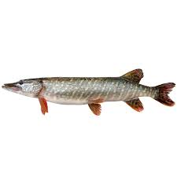

##Cwiczenie 1
### 1. Wybrany plik graficzny

---

### 2. Lista numerowana – trzy ulubione książki
1. „Mały Książę” – Antoine de Saint-Exupéry  
2. „Chłopcy z Placu Broni” – Ferenc Molnár  
3. „Rok 1984” – George Orwell  

---

### 3. Lista nienumerowana – pięć miast w Polsce
- Brodnica  
- Toruń  
- Szczecin  
- Zakopane  
- Białystok    

---

### 4. Dwa odnośniki do zasobów internetowych
- [Polska Biblioteka Internetowa](https://polona.pl/)  
- [NASA – oficjalna strona](https://www.nasa.gov/)  

---

### 5. Zdanie z wyróżnieniami
**bold**,*italic*, a ~~striketrough~~.

---

### 6. Wzór matematyczny (LaTeX)
Wzór na pole koła:  
$$S = \pi r^2$$

---

### 7. Dwa nagłówki
## To jest nagłówek poziomu 2
### To jest nagłówek poziomu 3
